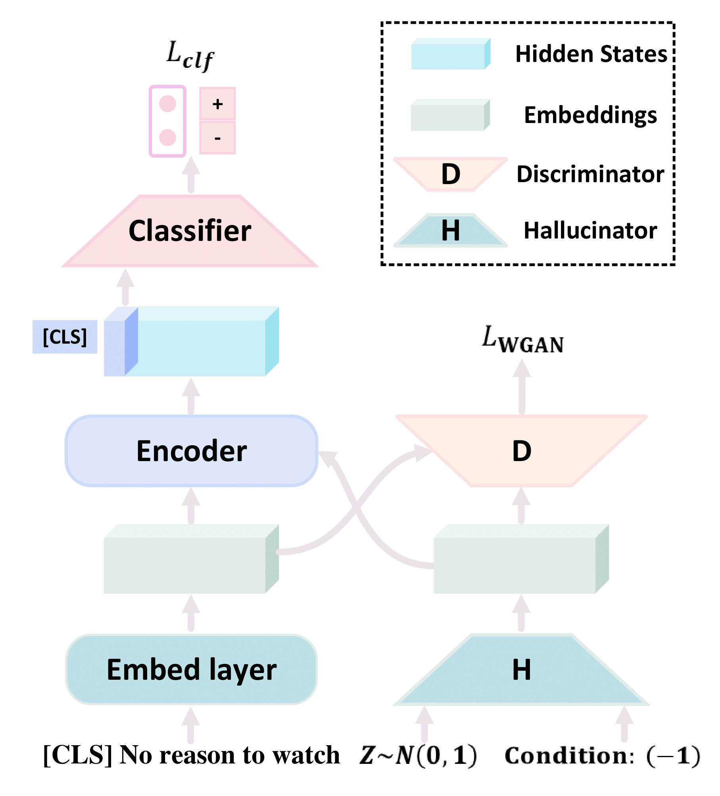

# Embedding Hallucination for Few-shot Language Fine-tuning

This repo covers the implementation of the following paper:  **[Embedding Hallucination for Few-shot Language Fine-tuning](https://aclanthology.org/2022.naacl-main.404/)** by [Yiren Jian](https://cs.dartmouth.edu/~yirenjian/), [Chongyang Gao](https://gcyzsl.github.io/) and [Soroush Vosoughi](https://www.cs.dartmouth.edu/~soroush/), accepted to NAACL 2022.



If you find this repo useful for your research, please consider citing the paper.
```bibtex
@inproceedings{jian-etal-2022-embedding,
    title = "Embedding Hallucination for Few-shot Language Fine-tuning",
    author = "Jian, Yiren  and
      Gao, Chongyang  and
      Vosoughi, Soroush",
    booktitle = "Proceedings of the 2022 Conference of the North American Chapter of the Association for Computational Linguistics: Human Language Technologies",
    month = jul,
    year = "2022",
    address = "Seattle, United States",
    publisher = "Association for Computational Linguistics",
    url = "https://aclanthology.org/2022.naacl-main.404",
    pages = "5522--5530",
    abstract = "Few-shot language learners adapt knowledge from a pre-trained model to recognize novel classes from a few-labeled sentences. In such settings, fine-tuning a pre-trained language model can cause severe over-fitting. In this paper, we propose an Embedding Hallucination (EmbedHalluc) method, which generates auxiliary embedding-label pairs to expand the fine-tuning dataset. The hallucinator is trained by playing an adversarial game with the discriminator, such that the hallucinated embedding is indiscriminative to the real ones in the fine-tuning dataset. By training with the extended dataset, the language learner effectively learns from the diverse hallucinated embeddings to overcome the over-fitting issue. Experiments demonstrate that our proposed method is effective in a wide range of language tasks, outperforming current fine-tuning methods. Further, we show that EmbedHalluc outperforms other methods that address this over-fitting problem, such as common data augmentation, semi-supervised pseudo-labeling, and regularization.",
}
```


Our code is  heavily borrowed from [LM-BFF](https://github.com/princeton-nlp/LM-BFF).

## Requirements

We tested our code on Nvidia RTX-A6000 and RTX-8000 and Nvidia A100. The requirements of packages are provided in `requirements.txt`. Install packages by
```shell
pip install -r requirements.txt
```

## Download data
We use pre-processed datasets (SST-2, SST-5, MR, CR, MPQA, Subj, TREC, CoLA, MNLI, SNLI, QNLI, RTE, MRPC, QQP) from  [LM-BFF](https://github.com/princeton-nlp/LM-BFF). LM-BFF offers helpful scripts for downloading and preparing the dataset. Simply run the commands below.
```shell
cd data
bash download_dataset.sh
```
Then use the following command to generate 16-shot datasets we used in the study.
```shell
python tools/generate_k_shot_data.py
```

## Collecting Real Embeddings
You will need to first collect real embeddings from the few-shot dataset (for further training of Hallucinator).
```shell
for task in sst-5
do
  for seed in 13 21 42 87 100
  do
      for bs in 2
      do
          for lr in 1e-5
          do
              TAG=LM-BFF \
              TYPE=finetune \
              TASK=$task \
              BS=$bs \
              LR=$lr \
              SEED=$seed \
              MODEL=roberta-large \
              bash run_collect_embeddings.sh
          done
      done
  done
done
```

## Training of Hallucinator
```shell
for TASK in sst-5
do
  for SEED in 13 21 42 87 100
  do
    python cwgan_main.py \
      --task $TASK \
      --seed $SEED \
      --few_shot_type 'finetune' \
      --model_name_or_path 'roberta-large'
  done
done
```

## Running our fine-tuning
Assuming you have one GPU in you system, we show an example of running our fine-tuning on SST-5.

```shell
for task in sst-5
do
  for seed in 13 21 42 87 100
  do
      for emb_bs in 4 6 8
      do
          for emb_lr in 1e-5
          do
              for kd_temperature in 0.4    #### is only used for LabelCalib
              do
                  TAG=exp \
                  TYPE=finetune \
                  TASK=$task \
                  BS=2 \
                  LR=1e-5 \
                  EMB_BS=$emb_bs \
                  EMB_LR=$emb_lr \
                  KD_TEMPERATURE=$kd_temperature \
                  SEED=$seed \
                  MODEL=roberta-large \
                  bash run_experiment.sh
              done
          done
      done
  done
done
```
Our framework also applies to prompt-based method, i.e., ```TYPE=prompt```.


## Collecting results
```
python tools/gather_result.py --condition "{'tag': 'exp', 'task_name': 'sst-5', 'few_shot_type': 'finetune', 'model_name_or_path': 'roberta-large'}"
```
It will collect the results from ```log``` and compute the mean and standard deviation over those 5 train-test splits.

## Contacts
For any questions, please contact authors.


## Acknowlegements
Thanks to [LM-BFF](https://github.com/princeton-nlp/LM-BFF), for the preliminary implementations.
